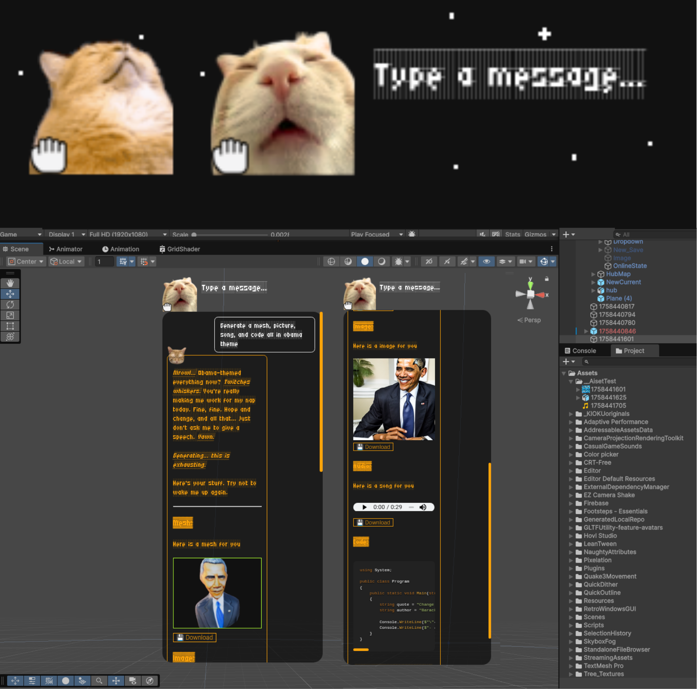

# Aiset 🐱‍👤

> **Aiset** — the grumpy (but talented) cat agent that helps you create video game assets and more: meshes, images, music, and code. It complains a lot, but the results are solid.

---

<!-- Badges (replace with real services) -->

  

## Preview

<video controls src="docs/media/demo.mp4">Placeholder demo video (docs/media/placeholder-demo.mp4)</video>

---

## What is Aiset?

Aiset is an **all-in-one desktop app** wrapped in a cheeky grumpy-cat personality. It helps creators generate:

* 🎨 3D Meshes (from text → `.glb`)
* 🖼️ Images (from text)
* 🎵 Music (from text)
* 💻 Code (from text)
* 🐱 Sarcastic conversations with a grumpy cat

It is intentionally opinionated — the cat will critique your prompts. Think of it as a helpful (and snarky) teammate.

⚠️ **Temporary hosting disclaimer:** Models are currently being served from the developer’s own PC for demo purposes. Functionality may stop working after \~3 days from publication (when the developer reclaims their machine). To ensure continued use, **please install and run the app locally**.

## Quickstart

### Install (Desktop Apps)

You can download **Aiset** directly from the [Releases tab](../../releases):

* **Windows** → `.exe` installer
* **Linux** → `.AppImage`
* **macOS** → `.app`

Just grab the package for your platform, install it, and run the grumpy cat.

## Usage

1. **Launch the app**
2. Type in what you want:

   * *“low-poly medieval lantern”* → outputs a `.glb` mesh
   * *“paint a neon cyberpunk street at night”* → outputs an image (`.png`)
   * *“compose chill lo-fi background music”* → outputs music (`.mp3`)
   * *“write a function that sorts a list of numbers”* → outputs code (`.txt`)
3. The grumpy cat will complain, then deliver.

## Example Prompts

* `"sci-fi crate with glowing edges"` → 3D mesh `.glb`
* `"forest clearing with mushrooms and fireflies"` → image `.png`
* `"8-bit style victory jingle"` → music `.mp3`
* `"python function to generate fibonacci numbers"` → code `.txt`

## Placeholder assets (what to replace)

* `docs/media/placeholder-ui.png` → Replace with UI screenshot
* `docs/media/placeholder-gen.gif` → Replace with short GIF of generation
* `docs/media/placeholder-demo.mp4` → Replace with walkthrough video
* `docs/media/placeholder-usage.png` → Replace with usage screenshot

## Roadmap

* [ ] Improve 3D mesh quality (better topology, textures)
* [ ] Add support for exporting multiple 3D formats (FBX, OBJ)
* [ ] Expand music styles and instruments
* [ ] In general better models!
* [ ] Push mesh, audio, and image model back-end for people to run locally 

## License

MIT — see `LICENSE`.

## Credits

* Idea & initial implementation: Ahmad Ramadan & Taro
* https://github.com/cawa-93/vite-electron-builder/ was used as the boiler play to build the electron app for different platforms.
* https://github.com/Stability-AI/stable-fast-3d was used to generate mesh quickly
* https://huggingface.co/stable-diffusion-v1-5/stable-diffusion-inpainting for light weight image generation
* *Gemini Flash 2.5*  for the model.

## Contact

If you want help integrating into your workflow or want to sponsor a feature, open an issue or email `s4toddora@gmail.com`.

---

*Last updated: 2025-09-21*
